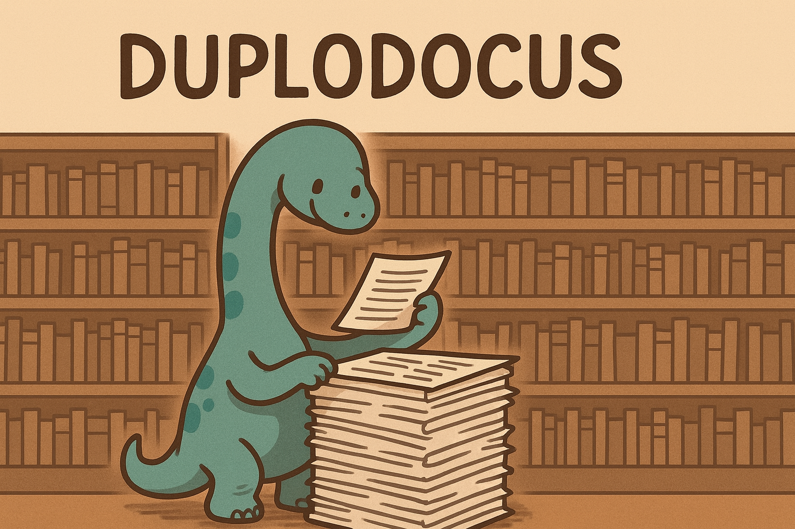

# Duplodocus CLI

High-performance exact and fuzzy (MinHash) document deduplication tool, natively implemented in Rust for processing large-scale JSONL datasets.
<div align="center">
    
</div>

## Table of Contents
- [Overview](#overview)
- [Theory/Primer](#theory)
- [Installation](#installation)
- [Quick Start](#quick-start)
- [Deduplication Methods](#deduplication-methods)
- [Examples](#examples)
- [Configuration](#configuration)
- [System Requirements](#system-requirements)

## Overview

This tool provides four deduplication strategies optimized for different dataset sizes and requirements:

| Method | Storage | Best For |
|--------|---------|----------|
| **Exact + Memory** | In-memory | Small datasets (<10GB), simple exact matching |
| **Exact + Disk** | Disk-based | Large datasets, exact matching, distributed processing |
| **MinHash + Memory** | In-memory | Small datasets (<10GB), fuzzy matching |
| **MinHash + Disk** | Disk-based | Large datasets, fuzzy matching, distributed processing |

### Key Features
- **Exact Deduplication**: Removes documents with identical content using fast hash-based matching
- **Fuzzy Deduplication**: Identifies near-duplicates using MinHash LSH based on [Lee et al. 2021](https://arxiv.org/abs/2107.06499)
- **Scalable**: Memory-based for simplicity or disk-based for datasets that don't fit in RAM
- **Distributed**: Disk-based methods support parallel processing across multiple machines
- **Flexible**: Annotate duplicates or remove them entirely

## Theory
Some notes on the theory behind this tooling and some details about the internals are contained in the [primer](primer.md).
## Installation

### Prerequisites
- Rust toolchain (1.70+)
- Git

### AWS EC2 Setup (Optional)

For large-scale processing on AWS i4i/i7i instances with NVMe drives:

```bash
# Configure RAID0 array from NVMe drives
sudo yum install mdadm -y
sudo mdadm --create /dev/md0 --level=0 --raid-devices=8 \
  /dev/nvme1n1 /dev/nvme2n1 /dev/nvme3n1 /dev/nvme4n1 \
  /dev/nvme5n1 /dev/nvme6n1 /dev/nvme7n1 /dev/nvme8n1
sudo mkfs.xfs /dev/md0
sudo mkdir /mnt/raid0
sudo mount /dev/md0 /mnt/raid0
sudo chown -R $USER /mnt/raid0

# Install build dependencies
sudo yum install gcc cmake openssl-devel g++ htop git -y

# Install s5cmd for fast S3 transfers
wget https://github.com/peak/s5cmd/releases/download/v2.2.2/s5cmd_2.2.2_Linux-64bit.tar.gz
tar -xvzf s5cmd_2.2.2_Linux-64bit.tar.gz
sudo mv s5cmd /usr/local/bin
```

### Build from Source

```bash
# Install Rust
curl --proto '=https' --tlsv1.2 -sSf https://sh.rustup.rs | sh
source ~/.bashrc

# Clone and build
git clone git@github.com:allenai/duplodocus.git
cd dedup-tool
cargo build --release

# Binary will be at: ./target/release/dedup-tool
```

### Download Data (if using S3)

```bash
# Configure AWS credentials
aws configure

# Download JSONL files
s5cmd cp -sp s3://your-bucket/path/to/data/* /mnt/raid0/input_data/
```

## Quick Start

### Exact Deduplication (Small Dataset)

Remove documents with identical content:

```bash
cargo run --release -- exact-dedup-memory \
  --input-dir /data/documents \
  --output-dir /data/unique \
  --text-key "content"
```

### Fuzzy Deduplication (Small Dataset)

Find and remove near-duplicates:

```bash
cargo run --release -- minhash-memory \
  --input-dir /data/documents \
  --storage-dir /tmp/work \
  --output-dir /data/deduped \
  --text-key "text" \
  --num-buckets 20 \
  --bucket-size 5 \
  --remove-duplicates true \
  --cleanup-storage
```

## Deduplication Methods

### Exact Deduplication

#### Memory-Based (Simple)

Best for datasets under 100GB. Processes everything in one pass:

```bash
cargo run --release -- exact-dedup-memory \
  --input-dir /data/docs \
  --output-dir /data/unique \
  --text-key "content" \
  --annotate-key "duplicate_info"  # Optional: annotate instead of remove
```

**Options:**
- `--hash-key`: Use pre-computed hash field instead of hashing text
- `--hash-bits`: Number of bits for hash (default: 128)
- `--annotate-key`: Add duplicate metadata instead of removing documents

#### Disk-Based (Distributed)

For large datasets or distributed processing:

**Step 1: Group documents by hash**
```bash
cargo run --release -- exact-dedup-disk-group \
  --input-dir /data/docs \
  --storage-dir /scratch/work \
  --hash-key "doc_hash" \
  --num-bins 100
```

**Step 2: Remove duplicates**
```bash
cargo run --release -- exact-dedup-disk-prune \
  --storage-dir /scratch/work \
  --output-dir /data/unique \
  --hash-key "doc_hash"
```

### Fuzzy Deduplication (MinHash)

#### Memory-Based (Simple)

All-in-one fuzzy deduplication for smaller datasets:

```bash
cargo run --release -- minhash-memory \
  --input-dir /data/docs \
  --storage-dir /tmp/work \
  --output-dir /data/deduped \
  --text-key "text" \
  --num-buckets 20 \
  --bucket-size 5 \
  --ngram-size 5 \
  --remove-duplicates true \
  --cleanup-storage
```

**Key Parameters:**
- `--num-buckets`: Number of LSH bands (more = stricter matching, default: 20)
- `--bucket-size`: Hashes per band (more = stricter matching, default: 5)
- `--ngram-size`: N-gram size for document shingling (default: 5)
- `--tokenizer`: Options: "cl100k", "p50k", "uniseg", or character-level
- `--config`: Optional YAML config file for all parameters

#### Disk-Based (Distributed)

For large-scale distributed processing across multiple machines:

**Step 1: Build file map** (run once)
```bash
cargo run --release -- mh-build-file-map \
  --input-dir /data/docs \
  --storage-dir /shared/work
```

**Step 2: Hash documents** (parallel across workers)
```bash
# Worker 0
cargo run --release -- mh-hash-docs \
  --local-input /data/docs \
  --storage-dir /shared/work \
  --text-key "text" \
  --path-chunk 0 \
  --num-path-chunks 10 \
  --num-buckets 20 \
  --bucket-size 5

# Worker 1
cargo run --release -- mh-hash-docs \
  --local-input /data/docs \
  --storage-dir /shared/work \
  --text-key "text" \
  --path-chunk 1 \
  --num-path-chunks 10 \
  --num-buckets 20 \
  --bucket-size 5

# ... repeat for workers 2-9
```

**Step 3: Gather edges** (run once, requires all signatures)
```bash
cargo run --release -- mh-gather-edges \
  --storage-dir /shared/work
```

**Step 4: Build Union-Find** (run once on single machine)
```bash
cargo run --release -- mh-build-uf \
  --storage-dir /shared/work \
  --num-path-chunks 10
```

**Step 5: Clean files** (parallel across workers)
```bash
# Worker 0
cargo run --release -- mh-clean-files \
  --input-dir /data/docs \
  --storage-dir /shared/work \
  --output-dir /data/deduped \
  --path-chunk 0 \
  --num-path-chunks 10 \
  --remove-duplicates true

# Repeat for other workers...
```

## Examples

Detailed examples with step-by-step instructions are available in the `examples/` directory:

- `examples/exact_simple/` - Simple exact deduplication
- `examples/exact_multi/` - Distributed exact deduplication
- `examples/fuzzy_simple/` - Simple fuzzy deduplication
- `examples/fuzzy_multi/` - Distributed fuzzy deduplication
- `examples/essential/` - Essential patterns and best practices

## Configuration

### YAML Configuration (Optional)

For complex setups, you can use a YAML config file:

```yaml
# minhash_config.yaml
minhash_params:
  num_buckets: 26
  bucket_size: 11
  ngram_size: 5
  permutation_seed: 42
  tokenizer: "cl100k_base"
eng_params:
  num_docs: 1000000
  max_lines_per_path: 100000
  num_sig_chunks: 8
output_params:
  annotate: false
  annotate_key: metadata.minhash # minhash output data location
  remove_duplicates: true # just annotate, don't remove
  delete_while_cleaning: false
```

Use with:
```bash
cargo run --release -- minhash-memory \
  --input-dir /data/docs \
  --storage-dir /tmp/work \
  --output-dir /data/deduped \
  --text-key "text" \
  --config minhash_config.yaml
```


## System Requirements

### Memory-Based Methods
- RAM: Dataset size + 2-3GB overhead
- Storage: Input size + output size
- Best for: Datasets under 100GB

### Disk-Based Methods
- RAM: ~8-16GB minimum
- Storage: 3-5x input dataset size (for intermediate files)
- Fast local storage strongly recommended (NVMe/SSD)
- Best for: Datasets over 100GB or distributed processing

### Recommended Instances (AWS)
- **Small jobs**: Any instance with enough memory to fit the dataset in RAM. 
- **Large jobs**: i4i.32xlarge or larger (NVMe storage)
- **Distributed**: Multiple i4i.32xlarge instances

## Design Principles

- **No remote I/O in Rust**: All S3 interaction happens outside Rust (use s5cmd, boto3, etc.)
- **Fast local storage**: Assumes fast disk for intermediate files
- **Small file assumption**: Individual JSONL files should fit in memory
- **Unique basenames**: Input files must have unique basenames within input directory

## Performance Tips

1. **Use RAID0 for NVMe drives** on cloud instances for maximum I/O throughput
2. **Adjust `--num-path-chunks`** based on available workers
3. **Monitor disk space** - intermediate files can be 3-5x input size
4. **Use `--cleanup-storage`** carefully in distributed settings
5. **Set appropriate `--num-buckets` and `--bucket-size`** for your similarity threshold

## Troubleshooting

**Out of memory errors**: Use disk-based methods instead of memory-based

**Slow performance**: Ensure you're using fast local storage (NVMe/SSD), not network storage

**Missing intermediate files**: Ensure all parallel steps complete before running sequential steps
